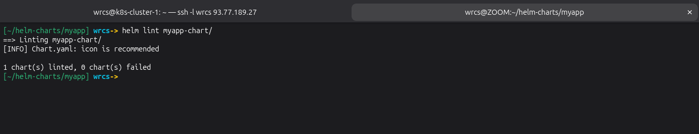
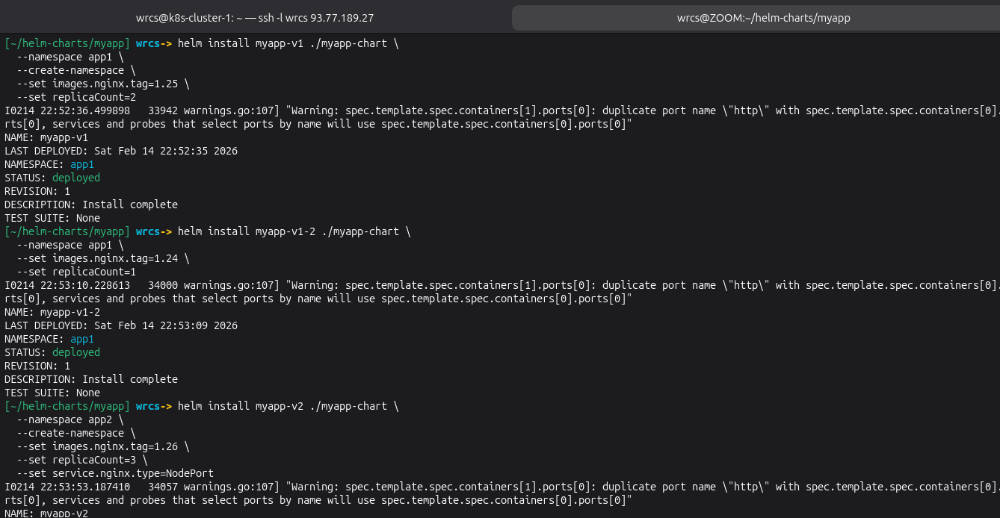
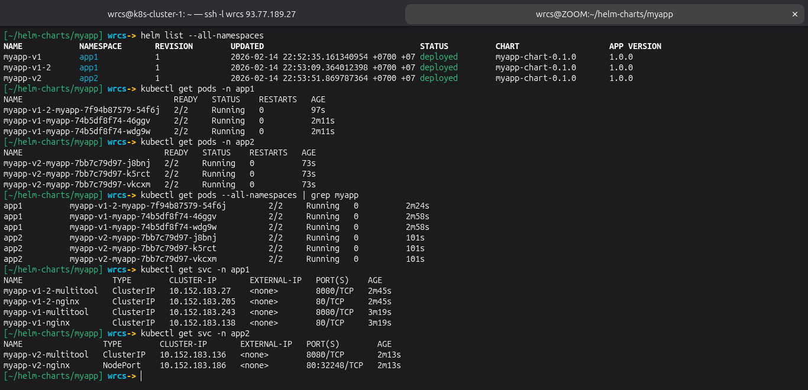

# Домашнее задание к занятию «Helm» Малявко С.Н.

### Задание 1. Подготовить Helm-чарт для приложения

### Задание 2. Запустить две версии в разных неймспейсах

### Файлы манифестов

- [файлы манифестов](helm-charts/myapp/myapp-chart)

### ✅ ЗАДАНИЕ ВЫПОЛНЕНО
